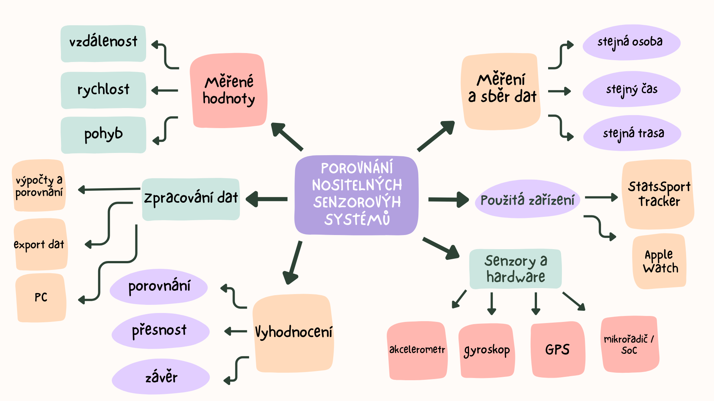

# Porovnání nositelných senzorových systémů ve sportu

## Úvod
Tento repozitář slouží jako kompletní dokumentace ročníkového projektu z předmětu **Mikropočítačové systémy**. Projekt je zpracováván průběžně během školního roku a veškeré materiály, dokumentace, schémata, zdrojové kódy a výsledky analýzy jsou ukládány právě zde.
Projekt se zaměřuje na využití mikropočítačových systémů v oblasti nositelné elektroniky. Konkrétně se zabývá porovnáním dvou nositelných senzorových zařízení – profesionálního sportovního trackeru **StatsSport** a chytrých hodinek **Apple Watch** – z hlediska přesnosti měření a zpracování pohybových dat.

## Cíl Projektu
Hlavním cílem projektu je porovnat přesnost a způsob zpracování dat dvou nositelných senzorových systémů používaných ve sportu – profesionálního trackeru StatsSport a chytrých hodinek Apple Watch.
Projekt se zaměřuje na analýzu vybraných měřených veličin, jako je vzdálenost, rychlost a pohybová aktivita, a na zhodnocení rozdílů v použitých senzorech a metodách zpracování dat.
Projekt je pojat z technického hlediska a soustředí se především na problematiku mikropočítačových systémů a senzorové techniky.

# Myšlenková mapa projektu
Tato kapitola obsahuje myšlenkovou mapu ročníkového projektu. Myšlenková mapa slouží k přehlednému rozdělení projektu na jednotlivé oblasti a pomáhá při jeho postupném zpracování.

## Myšlenková mapa

## Popis myšlenkové mapy
Středem myšlenkové mapy je téma porovnání nositelných senzorových systémů. Jednotlivé větve znázorňují hlavní oblasti projektu, jako jsou použitá zařízení, senzory a hardware, měření a sběr dat, zpracování dat a vyhodnocení výsledků.

Myšlenková mapa byla vytvořena v úvodní fázi projektu a bude sloužit jako podklad pro další rozpracování jednotlivých kapitol.

# Současný stav projektu
V této kapitole je popsán aktuální stav ročníkového projektu.

Projekt se v současné době nachází ve fázi rozpracování. Bylo stanoveno téma projektu, jeho cíl a základní struktura dokumentace. Dále byla vytvořena myšlenková mapa, která slouží jako přehled plánovaných částí projektu.

V rámci praktické části projektu již bylo zahájeno základní sbírání dat z nositelných zařízení. Tato činnost zatím slouží především k seznámení se s funkcemi zařízení, dostupnými daty a možnostmi jejich exportu a dalšího zpracování. Hlavní důraz je v této fázi kladen především na teoretickou část projektu.

Praktická část projektu bude dále rozvíjena v následujících etapách, kdy dojde k plánovanému a opakovanému měření za stejných podmínek a následnému vyhodnocení získaných dat.

# Použitá zařízení
V této kapitole jsou popsána zařízení, která jsou použita v rámci ročníkového projektu pro měření a sběr pohybových dat.

## STATSports Tracker
- STATSports Tracker je profesionální sportovní GPS zařízení určené především pro sledování výkonu hráčů v kolektivních sportech, jako je fotbal. Zařízení se běžně nosí v elastické vestě na zádech hráče mezi lopatkami.
- Tracker zaznamenává pohyb hráče během tréninku nebo zápasu a ukládá data, která jsou následně analyzována pomocí specializovaného softwaru.
- Tento tracker využívám i já sám, a to pro sledování vlastního výkonu a zlepšování fyzické kondice při tréninku.

## Apple Watch
- Apple Watch jsou chytré hodinky určené pro běžné uživatele. Kromě sledování času umožňují také měření pohybové aktivity, sportovních výkonů a zdravotních údajů jako je třeba měření kvality spánku, srdečního tepu a další.
- Hodinky jsou vybaveny několika senzory, které umožňují sledovat pohyb, vzdálenost a další parametry při sportovní aktivitě. Díky tomu jsou vhodné i pro základní porovnání s profesionálním sportovním trackerem.
- Apple Watch využívám především ke sledování kvality spánku, počtu kroků a základních zdravotních údajů, což mi pomáhá lépe hlídat denní režim a celkový zdravotní stav.

# Zdroje a citace
Níže jsou uvedeny zdroje informací, které byly použity při zpracování ročníkového projektu.

## Použité zdroje
STATSports. Online. STATSports | Performance Powered By Data | Athlete Monitoring. 2008. Dostupné z: https://statsports.com/. [cit. 2025-12-13].

Apple. Online. Apple (Česká republika). 1994. Dostupné z: https://www.apple.com/cz/. [cit. 2025-12-13].

## Doporučená literatura a zdroje
GPS vesta na fotbal – jak funguje a vyplatí se? Online. 2022. Dostupné z: https://topkopacky.cz/gps-vesta-fotbal/. [cit. 2025-12-13].

31 Years of Apple.com Website Design History - 39 Images - Version Museum. Online. Version Museum. Dostupné z: https://www.versionmuseum.com/history-of/apple-website. [cit. 2025-12-13].
